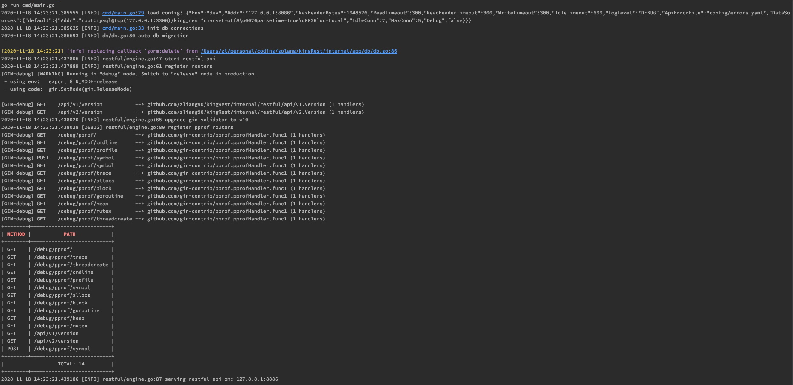

kingRest是基于golang+gin+gorm封装的restful api框架

Features：

- 简单三层业务逻辑 model/service/controller
- 升级validator至v10
- 自定义api错误消息
- 支持配置文件及api数据检验
- 日志库
- 一些扩展工具

how to run?

```shell
go get github.com/zliang90/kingRest

make
```


